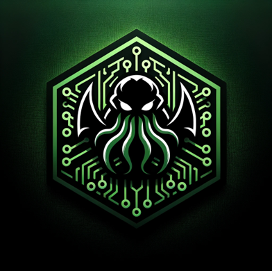

<p align="center">
  
</p>

## Documentation

- [📚 PYTRO Documentation](https://danette10.github.io/PYTRO-api/)

## Join Us on Discord

To discuss, get help, or test our project, join our Discord server by clicking the link below:

<a href="https://discord.gg/N3uUpTrtNR">
  
</a>

## Table of Contents

- [⚠️ DISCLAIMER ⚠️](#-disclaimer-)
- [Features](#features)
- [Requirements](#requirements)
- [Installation](#installation)
    - [SSL Certificate](#ssl-certificate)
    - [Flask-Migrate](#flask-migrate)
        - [Initialization of Flask-Migrate](#initialization-of-flask-migrate)
        - [Migration](#migration)
    - [Compiling the Client](#compiling-the-client)
    - [Generating a Self-Signed Certificate .exe File](#generating-a-self-signed-certificate-exe-file)
- [Contribution](#contribution)
- [License](#license)

## ⚠️ DISCLAIMER ⚠️

This project is developed for educational purposes only. The aim is to understand and demonstrate the security risks
associated with RAT (Remote Access Trojan) software and to encourage the development of effective countermeasures. The
author(s) of this project do not endorse any malicious use of the materials provided.

By using or interacting with this software in any way, you agree to use it solely for educational, ethical hacking, and
security research purposes. It is strictly forbidden to use the software for illegal activities, and the author(s) will
not be responsible for any misuse of the software.

All users are encouraged to report any vulnerabilities or security issues found within this software to the author(s)
for improvement. Remember, unauthorized access to computer systems is illegal and punishable by law. Always conduct your
security research within legal boundaries and with proper authorization.

Use this software at your own risk.

## Features

- **Security Risk Demonstration**: Showcases the threats posed by RATs.
- **Cybersecurity Awareness**: Educates users on good security practices.
- **RESTful API**: Provides an easy-to-use interface for integration and testing.

## Requirements

- Python 3.12+
- MySQL
- OpenSSL

# Installation

```bash
pip install -r requirements.txt
```

# SSL Certificate

To generate a self-signed certificate, run the following commands:

```bash
openssl req -x509 -newkey rsa:4096 -keyout key.pem -out cert.pem -days 365 -nodes
```

To run the server with the certificate, run the following command:

```bash
flask run --host=0.0.0.0 --port=5000 --cert=cert.pem --key=key.pem
```

# Flask-Migrate

## Initialization of Flask-Migrate

To create the database and tables, run the following commands:

```bash
flask db init
flask db migrate -m "Initial migration."
flask db upgrade
```

## Migration

To create a new migration, run the following commands:

```bash
flask db migrate -m "Description des modifications"
flask db upgrade
```

# Compiling the client

To compile the client, run the following command:

```bash
cd client
pyinstaller --onefile --noconsole --icon=logo.ico client.py
```

# Generating a Self-Signed Certificate .exe File

**The following commands are to be executed in PowerShell !**

To generate a self-signed certificate .exe file, run the following command:

```bash
New-SelfSignedCertificate -Type CodeSigningCert -Subject "CN=MySelfSignedCert" -KeySpec Signature -CertStoreLocation "Cert:\CurrentUser\My"
$mypwd = ConvertTo-SecureString -String "password" -Force -AsPlainText
```

This command will return a thumbprint, copy it and replace it in the following command:

```bash
Export-PfxCertificate -Cert "Cert:\CurrentUser\My\<thumbprint>" -FilePath "C:\Users\PC\Desktop\mycert.pfx" -Password $mypwd
```

Then, click here to download Windows SDK which contains signtool.exe: [Windows SDK](https://go.microsoft.com/fwlink/?linkid=2250105)

Finally, run the following command:

```bash
signtool sign /f "C:\Users\PC\Desktop\mycert.pfx" /p "password" /tr "http://timestamp.digicert.com" /td SHA256 /fd SHA256 /v "C:\path\to\client.exe"
```

# Contribution
For contribution guidelines, please see [CONTRIBUTING.md](.github/CONTRIBUTING.md).

# License
This project is licensed under the MIT License. See the [LICENSE](LICENSE) file for details.
